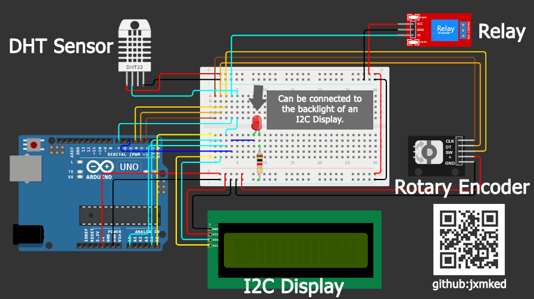

# Arduino Greenhouse Temperature Normalizer
This document details an Arduino program named arduino-greenhouse-temp-normalizer designed to automatically regulate temperature within a greenhouse environment.

## Components
- Arduino Board
- LCD Display (16x2 I2C)
- DHT Sensor (Temperature & Humidity)
- Relay Module (Controls Exhaust Fan)
- Rotary Encoder (User Input)

## Circuit

A circuit diagram illustrates the specific wiring connections between each component.

> Note: The red LED can be replaced with a jumper connecting to the I2C display's backlight for adjustable brightness. The display will automatically dim or brighten based on user interaction (rotary encoder movement) or when critical temperature thresholds are reached.

## Usage

#### How to adjust the threshold (Critical Temp)

Press the rotary encoder then rotate it clock wise or counter clock wise to adjust the threshold

#### Screen dimming feature

- Screen will dim automatically for a seconds then brighten for a few second.
- If the rotary encoder has been rotated or pressed the screen brightness will
brighten until a few second of no event happend from rotary encoder.
- The brightness automatically locked on bright when the threshold (Critial temp) 
is equal or lower than current temperature.

## Customization

The boot screen (initial display message) can be customized by editing the USE_BLOCK_BOOT value in the include/DEFINITION.h file. This file likely contains additional configuration options.

## Contact & Contribution

Feel free to reach out to the project creator, Jovan De Guia, for any questions or to contribute to the project's development.

- Email: jovandeguia@gmail.com
- Facebook: [Jovan De Guia](https://facebook.com/deguia25)
- Instagram: [@jxmked](https://instagram.com/jxmked)

Support the project via [Buy Me a Coffee](https://buymeacoffee.com/jxmked)

